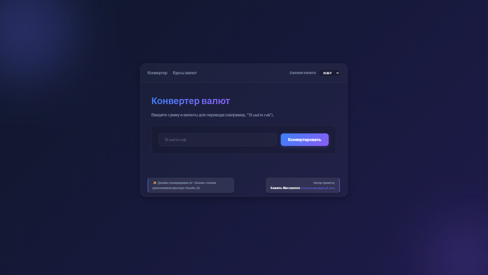
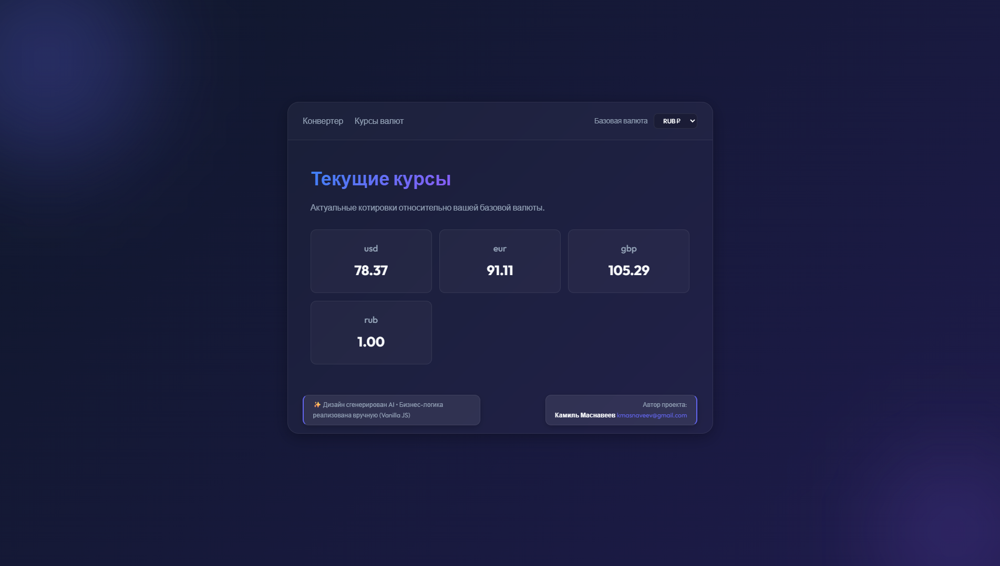

# AppBooster – Test Assignment

---

## 🇷🇺 Русский

### Обзор
**AppBooster Test Assignment** — это одностраничное приложение (SPA), созданное на чистом **JavaScript, HTML и CSS**. Проект демонстрирует современный UI в стиле glass‑morphism, клиентский хэш-роутинг, реактивный стейт-менеджер и сервис конвертации валют.

Проект создан **без единого фреймворка** — вся отрисовка, роутинг и управление состоянием написаны вручную.

### Скриншоты

| Конвертер валют | Курсы валют |
|---|---|
|  |  |

### Возможности
- **Дизайн в стиле glass‑morphism** — градиенты, тени, плавные анимации.
- **Хэш-роутинг** (`#/`, `#/rates`) — работает без настройки сервера.
- **Реактивный State Manager** (`src/state.js`) на базе `Proxy` API — компоненты подписываются на изменения глобального состояния.
- **Сервис конвертации валют** (`src/convert.service.js`) — получает актуальные курсы с публичного CDN.
- **Чистый JS-рендеринг** — весь UI генерируется на стороне JS; в `index.html` только `<div id="app"></div>`.
- **Адаптивная вёрстка** — корректно работает на десктопе и мобильных устройствах.
- **Модульные компоненты страниц** (`ConverterPage.page.js`, `RatesPage.page.js`).
- **Singleton-сервисы** — `ConvertService` и `StateManager` реализованы как Singleton.

### Стек технологий
- **HTML5** — минимальная разметка, только корневой элемент.
- **CSS3** — переменные, keyframe-анимации, glass‑morphism.
- **JavaScript ES6+** — `import/export`, `async/await`, `Proxy`, приватные поля классов (`#`).
- **Fetch API** — получение курсов обмена валют.

### Структура проекта
```
appbooster/
├─ index.html               # только <div id="app"></div> + тег скрипта
├─ src/
│   ├─ main.js             # точка входа, инициализация App и роутера
│   ├─ App.js              # компонент-оболочка (шапка, футер, router-view)
│   ├─ router.js           # хэш-роутер
│   ├─ state.js            # реактивный стейт-менеджер (Singleton)
│   ├─ convert.service.js  # сервис конвертации (Singleton)
│   ├─ pages/
│   │   ├─ ConverterPage.page.js
│   │   └─ RatesPage.page.js
│   └─ styles.css          # стили glass‑morphism
└─ README.md
```

### Запуск
1. Клонируйте репозиторий:
   ```bash
   git clone <repo‑url>
   cd appbooster
   ```
2. Откройте `index.html` в браузере — сборка не требуется.
3. **Опционально** — запустите статический сервер:
   ```bash
   npx -y http-server ./ -c-1
   ```
   Затем откройте `http://localhost:8080`.

### Тестирование
Тесты написаны с помощью **[Vitest](https://vitest.dev/)** в jsdom-окружении.

```bash
npm install          # установка Vitest и jsdom
npm test             # запуск всех тестов
npm run test:watch   # режим наблюдения
npm run test:coverage  # отчёт о покрытии
```

| Модуль | Файл теста | Что тестируется |
|---|---|---|
| `ConvertService` | `convert.service.test.js` | Singleton, мок fetch, регистр валют, null при ошибке, точность округления |
| `StateManager` | `state.test.js` | Начальное состояние, реактивность Proxy, subscribe/unsubscribe, игнор дублей |
| `Router` | `router.test.js` | Резолвинг маршрутов, fallback, хук `afterRender`, namespace в `window` |
| `ConverterPage` | `converterPage.test.js` | Парсинг ввода, CSS-класс ошибки, успешный путь |

---

## 🇬🇧 English

### Overview
**AppBooster Test Assignment** is a single‑page application built with **plain JavaScript, HTML and CSS**. It showcases a modern glass‑morphism UI, hash‑based client‑side routing, a lightweight reactive state manager, and a real‑time currency‑conversion service.

The project is deliberately **framework‑free** – all rendering, routing and state handling are handcrafted.

### Screenshots

| Converter | Exchange Rates |
|---|---|
|  |  |

### Features
- **Glass‑morphism design** with vibrant gradients, subtle shadows and smooth micro‑animations.
- **Hash‑based routing** (`#/`, `#/rates`) – no server configuration required.
- **Reactive State Manager** (`src/state.js`) built on the `Proxy` API.
- **Currency conversion service** (`src/convert.service.js`) fetching live rates from a public CDN.
- **Pure‑JS rendering** – `index.html` only contains a root `<div id="app"></div>`.
- **Responsive layout** – desktop and mobile friendly.
- **Modular page components** (`ConverterPage.page.js`, `RatesPage.page.js`).
- **Singleton services** – `ConvertService` and `StateManager` follow the Singleton pattern.

### Tech Stack
- **HTML5** – minimal markup.
- **CSS3** – custom properties, keyframe animations, glass‑morphism effects.
- **JavaScript ES6+** – `import/export`, `async/await`, `Proxy`, private class fields (`#`).
- **Fetch API** – retrieving exchange‑rate data.

### Project Structure
```
appbooster/
├─ index.html               # only <div id="app"></div> + script tag
├─ src/
│   ├─ main.js             # entry point, renders App & starts router
│   ├─ App.js              # shell component (header, footer, router-view)
│   ├─ router.js           # hash‑based router
│   ├─ state.js            # reactive state manager (Singleton)
│   ├─ convert.service.js  # conversion service (Singleton)
│   ├─ pages/
│   │   ├─ ConverterPage.page.js
│   │   └─ RatesPage.page.js
│   └─ styles.css          # glass‑morphism stylesheet
└─ README.md
```

### Getting Started
1. Clone the repository:
   ```bash
   git clone <repo‑url>
   cd appbooster
   ```
2. Open `index.html` directly in a browser – no build step needed.
3. **Optional** – use a local static server:
   ```bash
   npx -y http-server ./ -c-1
   ```
   Navigate to `http://localhost:8080`.

### Testing
Tests are written with **[Vitest](https://vitest.dev/)** and run inside a jsdom environment.

```bash
npm install            # install vitest + jsdom
npm test               # run all tests once
npm run test:watch     # watch mode
npm run test:coverage  # coverage report
```

| Module | Test file | What is covered |
|---|---|---|
| `ConvertService` | `convert.service.test.js` | Singleton, fetch mocking, case insensitivity, null on failure, decimal precision |
| `StateManager` | `state.test.js` | Initial state, Proxy reactivity, subscribe/unsubscribe, no-op on same value |
| `Router` | `router.test.js` | Route resolution, fallback, `afterRender` lifecycle, window namespace |
| `ConverterPage` | `converterPage.test.js` | Input parsing, error CSS class, successful conversion flow |

---

*Создано с любовью. Дизайн сгенерирован AI, логика написана вручную на Vanilla JS.*  
*Built with love. AI‑generated design, handcrafted vanilla‑JS logic.*
